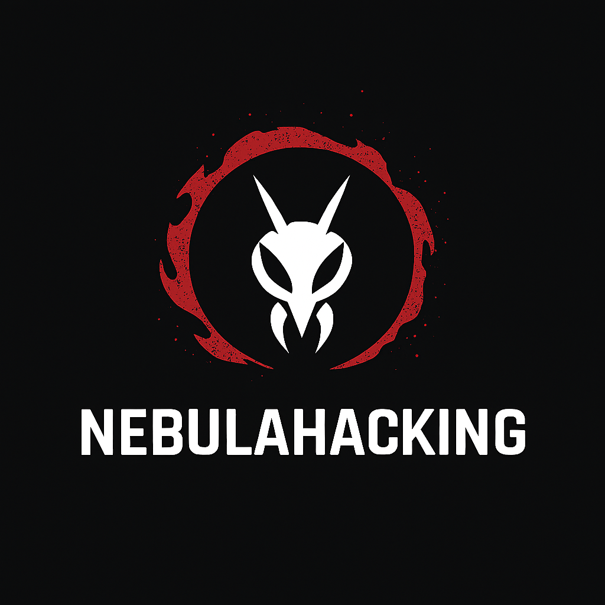

🌌 Nebula Terminal Custom v 1.2

Nebula Terminal Custom is an open-source Python project make by the Nebula Cyber security Team 

  
  

That brings a full custom terminal experience for learning, experimentation, and cybersecurity exploration.

Step inside a professional hacking-style console with a virtual file system, built-in text editor, and powerful simulation tools, all running locally on your machine.

🚀 Overview

Nebula Terminal Custom is your safe, offline playground to explore system commands, network simulations, and creative terminal experiments.
Perfect for students, developers, and enthusiasts who want to practice, tinker, and learn in a realistic console environment.

🧩 Features
🖥️ Terminal Core

Fully interactive terminal loop

Virtual File System (VFS) for creating, saving, and navigating files

Built-in text editor for quick edits and notes

Colorful Linux-style prompt with full command history

⚡ Simulated Tools

Network scanning & analysis

Directory exploration

IP & server information gathering

Calculator, weather, and mini-games

And more… all in a safe simulation environment

Everything is designed for learning and experimentation, no real hacking required.

💡 Example Usage

scan -f 192.168.0.1

dirb -m https://example.com

iptracker -m 8.8.8.8

knano notes.txt

calc

save

load

history

Explore, experiment, and learn – all within the Nebula Terminal.

🧠 Philosophy

Nebula Terminal Custom isn’t just a program — it’s a creative learning environment.

Immerse yourself in the hacker console aesthetic, explore commands, test ideas, and develop your skills in Python, networking, and cybersecurity concepts – safely, offline, and freely.

⚙️ Tech Stack

Language: Python 3

Key libraries: colorama, requests, folium, pyfiglet, psutil, keyboard, socket, tkinter

Cross-platform: Windows & Linux

🧰 Installation & Run

git clone https://github.com/Ma4gLaptop/Nebula-Terminal-Custom.git

cd Nebula-Terminal-Custom

python(3) launch.py (if you want to run with venv)

OR

python(3) main.py (if you have all the librairies installed)

Step into your custom terminal world and start experimenting! 🌠
