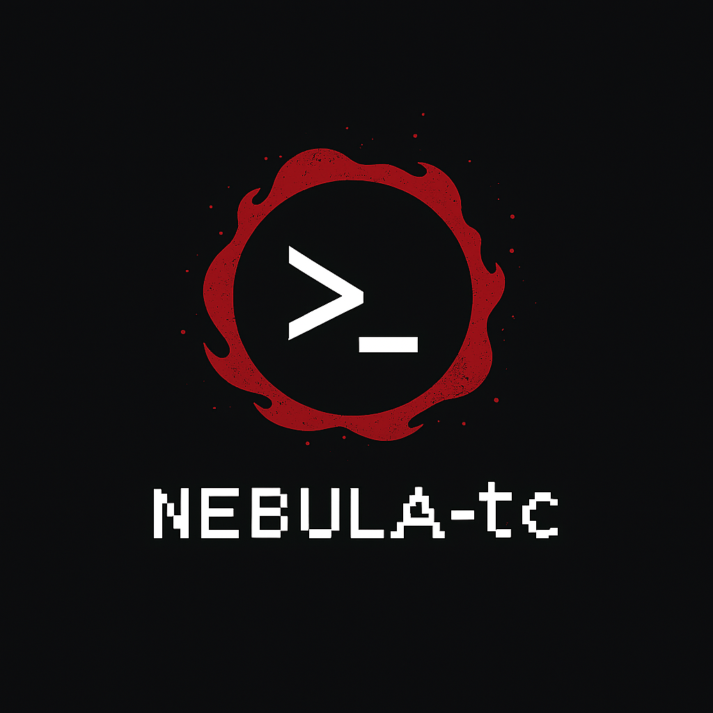
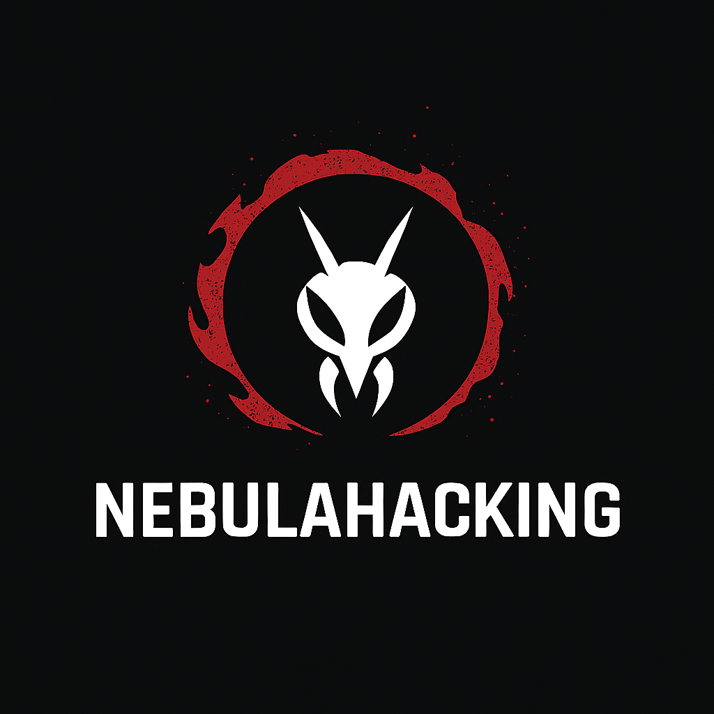

# Nebula Terminal (Version 1.4)

Nebula Terminal is an open-source Python project developed by the Nebula Cyber Security Team. It provides a modular terminal environment designed for learning, experimentation, and cybersecurity education through a Linux-inspired command-line interface.

<div align="center">
  
  
</div>

## Overview

Nebula Terminal combines a custom shell with a collection of utilities dedicated to networking, system administration, and cybersecurity. The project is designed as a modular platform where new commands and tools can easily be integrated.

Current features include:

- Custom interactive terminal
- Virtual file system
- Built-in text editor
- Network and port scanning tools
- IP information and tracking utilities
- Secure web browser
- Graphical interface
- System information utilities
- Wordlist generator
- Integrated AI module (work in progress)
- Modular architecture for future extensions

## Project Goals

The primary objectives of Nebula Terminal are:

- Learn Python through a large-scale project
- Explore networking and cybersecurity concepts
- Build an extensible terminal framework
- Provide a safe environment for experimentation

Nebula Terminal is intended for educational purposes and should only be used on systems you own or are authorized to test.

## Requirements

- Python 3.11 or later
- Windows or Linux

## Installation

Clone the repository:

```bash
git clone https://github.com/Ma4gLaptop/Nebula-Terminal-Custom.git
cd Nebula-Terminal-Custom
```

Create a virtual environment (recommended):

```bash
python -m venv venv
```

Activate it:

### Windows

```powershell
venv\Scripts\activate
```

### Linux

```bash
source venv/bin/activate
```

Install the required dependencies:

```bash
pip install -r requirements.txt
```

## Running

If you use the provided launcher:

```bash
python launch.py
```

Or run the application directly:

```bash
python main.py
```

## License

This project is released under the MIT License.

## Status

Nebula Terminal is under active development. Features, architecture, and documentation may evolve over time.
